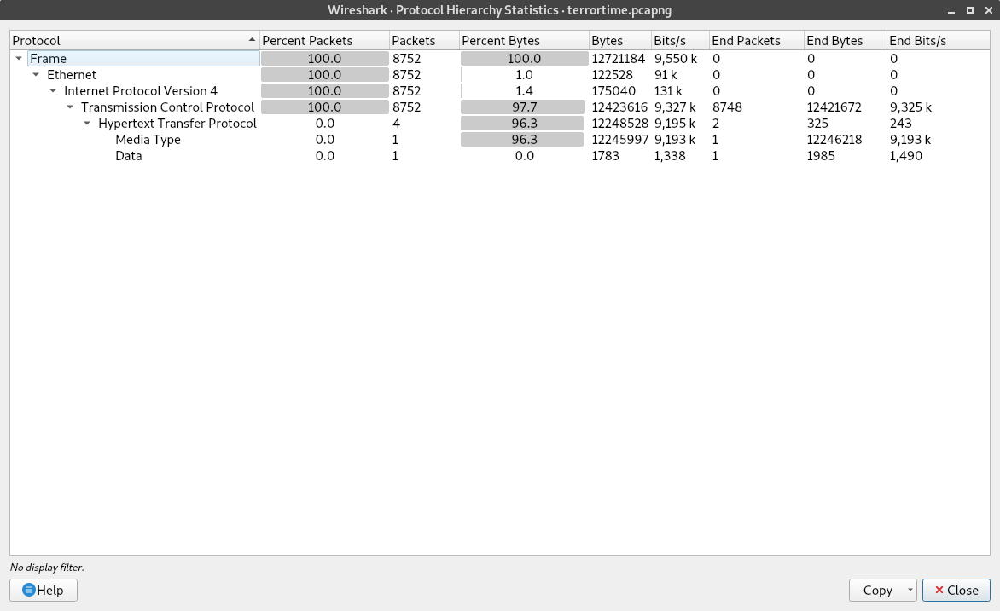
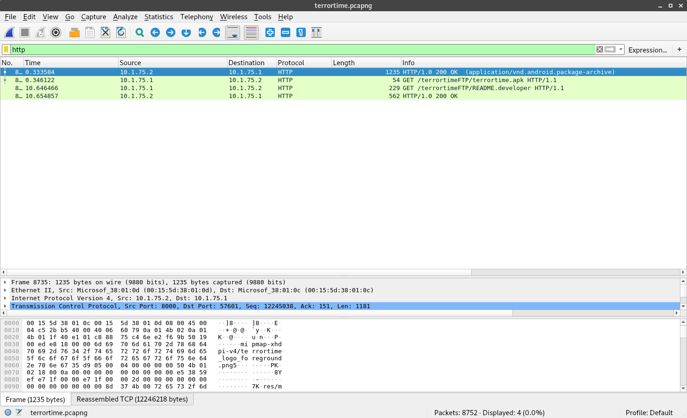
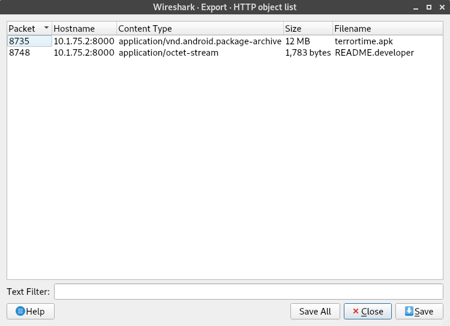

# Task 1
## It Begins! - [Getting Started - Part 1] - (Network Traffic Analysis)

### Task Details

There are many challenges that we will need to overcome in order to exploit TerrorTime. The first is that we do not yet have a copy of it. We have learned few details through intelligence sources, but the terrorists have managed to keep the app hidden. It is not publicly available on any App Store. Fortunately, as part of a recent military operation, specialized collection gear was forward deployed near the terrorist's area of operations. This resulted in a trove of collected traffic and we need your help to analyze it. Your first task is to find and extract a copy of the TerrorTime Android Package (APK) file from the packet capture. Submit the APK's SHA256 hash. This will help us search other intelligence sources for connections to users. To test out the app, we also need the registration information their leadership uses to register each client. Analyze the packet capture for this data and submit the registration information for 2 clients (in any order).

### Required Files
- [terrortime.pcapng](terrortime.pcapng)

## Solution

The pcapng (often just called a pcap) contains network information from some traffic capture. Typically these files are created with `wireshark` or `tcpdump`. These utilities will save the data that is sent across an interface. Interfaces can be found by typing `ip addr`. 

To start, we need to find what kind of traffic is available in our pcap file. We can just scroll through the pcap file if it is small enough, or we can look at the **Protocol Hierarchy Statistics** by going to *Statistics->Protocal Hierarchy*:



We can see that the pcap file includes Transmission Control Protocol (TCP) and Hypertext Transfer Protocol (HTTP). We should take a look the four packets of HTTP. To do this, we can just apply a filter by typing the protocol we want:



We can see that there are two 200 status codes, but there are also two `GET` requests in this pcap. That means that there was data transfered in this pcap and we might be able to extract that data. There is a hard and easy way to do this. The hard way is to inspect each of those `GET` requests and save the data transfered. The easy way is to go to *File->Export Objects->HTTP*. This will show a window like the following: 



We can see that there are two objects to export, namely **terrortime.apk** and **README.developer**. 

```
Save these files to your machine using the dialog.
```

### Find the sha256 of the apk

To find the sha256 of the apk, we can use a standard Linux utility, `sha256sum`. This will calculate the hash for us. Assuming you are running the command in the same directory where you saved the files:

```bash
sha256sum terrortime.apk
```

See the [#Submission](#Submission) section for the proper output for this example.


### README Investigation

Opening the `README.developer` file returned the following information:

```
Terrortime developer log README 
 
Testing Resources: 
------------------ 
terrorTime.apk -- Most current version of terrortime APK for android mobile devices 
matthew--vhost-367@terrortime.app -- First Terrortime test account client id 
jean--vhost-367@terrortime.app -- Second Terrortime test account client id 
8bdKFOY2AZuIUU -- First Terrortime test account client secret 
yZBZ46hJ8rSASr -- Second Terrortime test account client secret 
 
Used above client information for testing. See test report in Master. 
 
Dev bob's comments on most recent APK code changes 
--------------------------------------------------- 
(20190613) Beta version of Terrortime app completed. Successfully tested. Waiting for customer feedback. 
 
(20190723) Had to make some notable changes to Terrortime authentication mechanisms based on new Customer requirements (as of this week). Code changes were just committed to Master. Not pretty, but will support future "operational" needs (didn't ask ...don't want to know the details). 
 
Changes also support recently clarified deployment/use CONOP. App will be installed and pre-configured on mobile device before device is given to associate. Associate must use app as configured to interact with Terrortime chat service and will not be provided plaintext version of credentials required for part of authentication process. App will use its credentials to authenticate itself to Terrortime infrastructure, a process that will be transparent to user/associate. Associate will be provided a PIN that allows him/her to open Terrortime app.  
 
See design documentation in Master README file for details. 
 
(20190725) After a few bug fixes, Terrortime app passed testing. No rest for the weary. 
 
(20190726) Packaged up and ready to ship! $$$$ 
```

Underneath the **Testing Resources** heading, there are two test acount ids and test account secrets. Those are what the first task is asking for. See the [#Submission](#Submission) section for an example on how to properly format the answer.

Note: The `username:password` format is a standard format for sending a username and password to a service. Google "Basic HTTP Authorization" for more information. The only difference is that the HTTP authorization can be base64 encoded.


## Submission

The following are the correct answers to the challenge for this particular file:

### APK Hash
- 0xa07fe82b7d99be3f3cea23dee61e0076a480dd9bf547cb5c3ae09ed0a0971b99

### Credentials
- matthew--vhost-367@terrortime.app:8bdKFOY2AZuIUU
- jean--vhost-367@terrortime.app:yZBZ46hJ8rSASr
