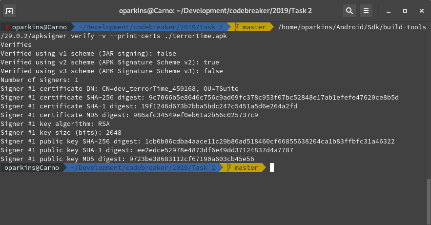

# Task 2
## Permissions - [Getting Started - Part 2] - (Mobile APK Analysis)

The TerrorTime APK file contains metadata that describes various security properties of the application that we want to know. Since we now have a copy of the APK thanks to the military operation described in Task 1, we need you to identify and submit the following:

- App Permissions
- The SHA256 hash of the Code Signing Certificate
- The Common Name of the Certificate Signer

Please note that completion of task 1 is required to complete this task.

### Required Files
- [terrortime.pcapng](../Task\ 1/terrortime.pcapng)

## Solution

### Certificate Information

There were several attempts to do this correctly, including using `binwalk`. `binwalk` is an amazing tool for analyzing binaries that everyone should take a look at. Even though I went this route for a while, we couldn't get one of the answers correct. After more time than I want to admit, I found a tool called `apksigner`. This is like the `jarsigner` if you are familiar with `.jar` files, but this works on `.apk` files. In fact, `jarsigner` will return the wrong information for you. 

You can install `apksigner` by installing the `android-sdk`. You will need to research this for your own distribution. The tool will not be immediately available most likey as it is not found in your `PATH` environment variable. I did the following to find it:

```bash
find ~ | grep -i apksigner
```

If you installed it in your home folder, it will be found eventually.

If you look online or at the man page, you will find out how to print the certificate information. The output of the tool for me was:


There are two important parts for us. First, is the Common Name (CN) of the certificate. This is going to be `dev_terrorTime_459168`. The second is the sha256 of the certificate which is `9c7066b5e8646c756c9ad69fc378c953f07bc52848e17ab1efefe47620ce8b5d`. 

With just one tool, we found the answers to two questions. Now we can move onto the last question: App Permissions.

## App Permissions
To get the app permissions, we have to convert the AndroidManifest.xml file to ascii. There are two ways to do this. First, install Android Studio and load the apk. You will be able to find the permissions. Personally, I used the tool found at https://github.com/ytsutano/axmldec. This tool will convert from binary and allow you to see the permissions listed. The installation instructions found on the README worked for me with no problem:

```
$ cd ~/Development
$ git clone --recursive https://github.com/ytsutano/axmldec.git
$ cd axmldec
$ cmake -DCMAKE_BUILD_TYPE=Release . && make
```

After the tool built, I then ran into an issue with running the tool on the apk directly. Instead, it worked by running the command on the binary `AndroidManifest.xml` directly. I used `binwalk` to extract the file:
```
$ binwalk -e terrortime.apk
$ ~/Development/axmldec/axmldec -i ./_terrortime.apk.extracted/AndroidManifest.xml
```

This returned the following file:
```xml
<?xml version="1.0" encoding="utf-8"?>
<manifest xmlns:android="http://schemas.android.com/apk/res/android" android:versionCode="1" android:versionName="1.0" android:compileSdkVersion="28" android:compileSdkVersionCodename="9" package="com.badguy.terrortime" platformBuildVersionCode="28" platformBuildVersionName="9">
  <uses-sdk android:minSdkVersion="26" android:targetSdkVersion="28"/>
  <uses-permission android:name="android.permission.INTERNET"/>
  <uses-permission android:name="android.permission.ACCESS_NETWORK_STATE"/>
  <application android:theme="type1/2131689478" android:label="type1/2131623986" android:icon="type1/2131558402" android:name="com.badguy.terrortime.TerrorTimeApplication" android:debuggable="true" android:configChanges="0xa0" android:allowBackup="false" android:supportsRtl="true" android:fullBackupContent="false" android:usesCleartextTraffic="true" android:roundIcon="type1/2131558404" android:appComponentFactory="android.support.v4.app.CoreComponentFactory">
    <activity android:theme="type1/2131689480" android:label="type1/2131624038" android:name="com.badguy.terrortime.ContactActivity" android:launchMode="1"/>
    <activity android:name="com.badguy.terrortime.MainActivity" android:windowSoftInputMode="0x2">
      <intent-filter>
        <action android:name="android.intent.action.MAIN"/>
        <category android:name="android.intent.category.LAUNCHER"/>
      </intent-filter>
    </activity>
    <activity android:label="TerrorTime Settings" android:name="com.badguy.terrortime.SettingsActivity" android:parentActivityName="com.badguy.terrortime.MainActivity"/>
    <activity android:label="type1/2131623987" android:name="com.badguy.terrortime.RegisterActivity" android:parentActivityName="com.badguy.terrortime.MainActivity"/>
    <activity android:label="type1/2131623985" android:name="com.badguy.terrortime.LoginActivity" android:parentActivityName="com.badguy.terrortime.MainActivity"/>
    <activity android:label="Chat" android:name="com.badguy.terrortime.ChatActivity" android:windowSoftInputMode="0x10" android:parentActivityName="com.badguy.terrortime.ContactActivity"/>
    <provider android:name="android.arch.lifecycle.ProcessLifecycleOwnerInitializer" android:exported="false" android:multiprocess="true" android:authorities="com.badguy.terrortime.lifecycle-trojan"/>
  </application>
</manifest>
```

Inside the file, there are tags labeled `<uses-permission>`. The two names are `INTERNET` and `ACCESS_NETWORK_STATE`.

## Submission

App Permissions
- INTERNET
- ACCESS_NETWORK_STATE


SHA256 of Signing Cert (Hexadecimal/Base16 encoded): 
- 9c7066b5e8646c756c9ad69fc378c953f07bc52848e17ab1efefe47620ce8b5d

Certificate Signer name:
- dev_terrorTime_459168

