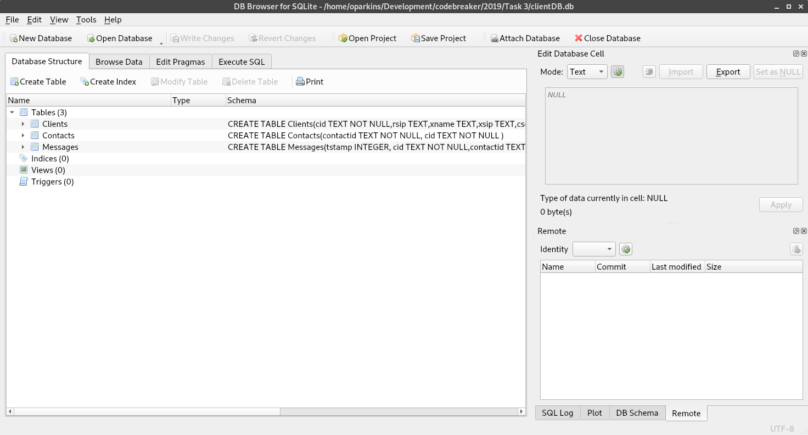
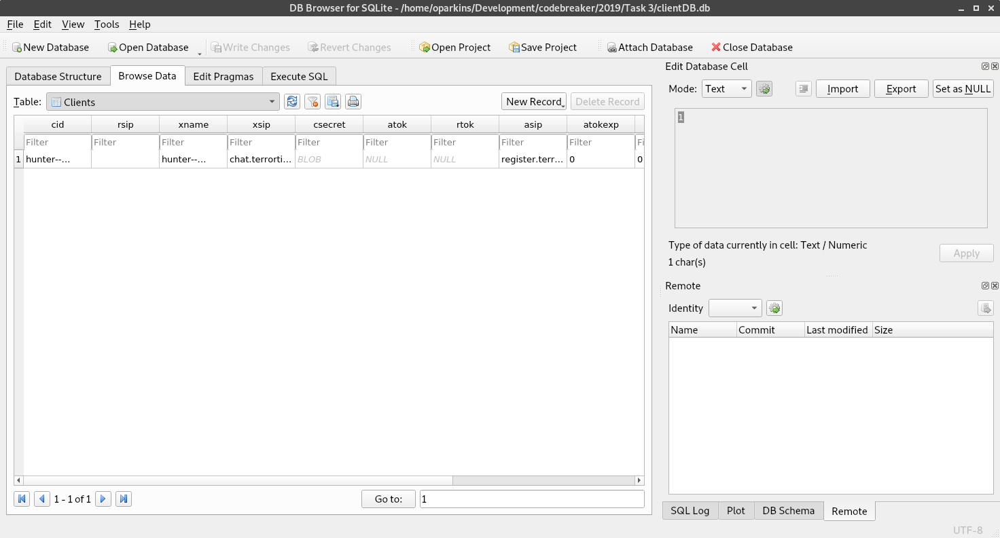

# Task 3
## Turn of Events - [Getting Started - Part 3] - (Database Analysis)

Analysts found TerrorTime installed on a device that was taken from a terrorist arrested at a port of entry in the US. They were able to recover the SQLite database from the TerrorTime installation on the device, which should provide us with more in-depth knowledge about the terrorist's communications and the TerrorTime infrastructure. Your goal for this task is to analyze the database and submit the addresses of the TerrorTime OAUTH (authentication) and XMPP (chat) servers.

### Required Files
- [clientDB.db](clientDB.db)

## Solution

Given to us is important information about the database file. We know it is a SQLite database. Any SQLite database editor will work. I am using `DB Browser for SQLite`. When I load the database file, I get the following window:



The `Database Structure` view shows that there are three different tables available.

By going to the `Browse Data` tab, we can see that there is only one client row. 



In addition, there is no data in the other tables. This means we only have piece of information to look at. Most of this task is just process of elimination. 

First, `cid` will most likely stand for Client ID. The only other interesting ones that we can read without an problems is xsip and asip. We know we are looking for the authentation and xmpp server locations. Inside these two fields, we see a string with periods. Upon first glance you may think that they are Java namespaces or something to do with the application, but `.app` is a proper Top Level Domain (TLD). Another example of a TLD is `.com` which most individuals should be familiar with.

To get IP addresses from the two domains we found, we can use `nslookup`:

### chat.terrortime.app
```
$ nslookup chat.terrortime.app
Server:		129.138.250.10
Address:	129.138.250.10#53

Non-authoritative answer:
Name:	chat.terrortime.app
Address: 54.91.5.130

```

### register.terrortime.app
```
$ nslookup register.terrortime.app
Server:		129.138.250.10
Address:	129.138.250.10#53

Non-authoritative answer:
register.terrortime.app	canonical name = codebreaker.ltsnet.net.
Name:	codebreaker.ltsnet.net
Address: 54.197.185.236
```

Use the non-authoritative answer addresses.

## Submisions
### XAMP
- 54.91.5.130

### Chat
- 54.197.185.236