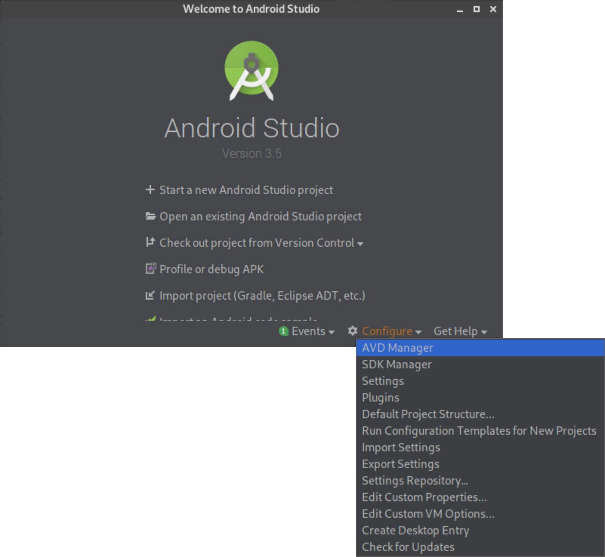
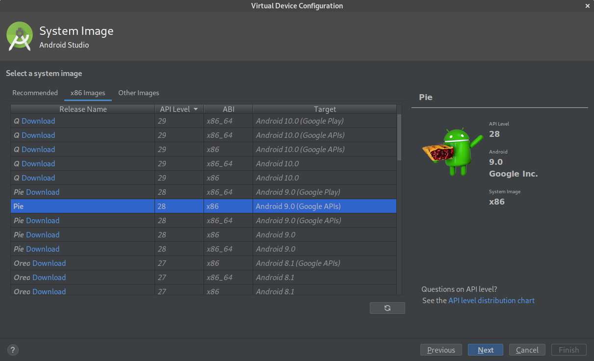
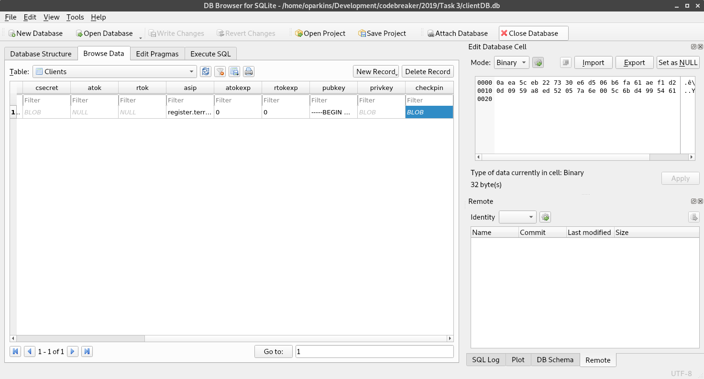
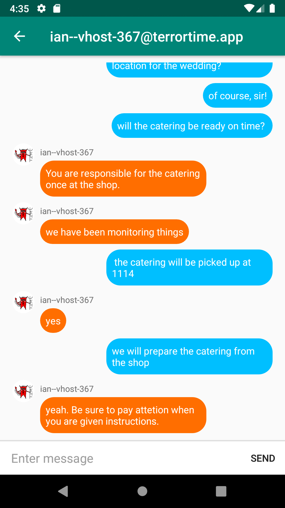

# Task 4
## Schemes - (Cryptography; Reverse Engineering; Language Analysis)

While analyzing the TerrorTime SQLite database found on the terrorist’s device, analysts discovered that the database has cached credentials but requires a pin to log in. If we can determine how the credentials are protected and find a way to recover the pin, we should be able to masquerade as the arrested terrorist. Perform reverse engineering to identify how the terrorist’s credentials are protected and submit the terrorist's Client ID and Client Secret. Once you have uncovered their credentials, masquerade (i.e., login) as him using the TerrorTime app. Review their chat history and assess additional information regarding their organization. Though the app encrypts messages back and forth, the terrorists have previously spoken in some form of code to ensure their plans were protected. To prove completion of this task, you will need to analyze the terrorist's conversation history in order to uncover/deduce the following information:

- Terror Cell Leader's Username
- Action planned by the terrorist cell
- The date on which the action will occur

**Note that there is a new terrorTime.apk file to use. It was updated to help with dropping connections. Use this new binary instead of the binary in Task 1 and Task 2**

## Solution

### Emulator Setup

We need to get an emulator working before we can finish this project. The main reason is that we need to be able to get the messages while they are in transport. While you would be able to run this application on a standard Android phone it is easier to complete man-in-the-middle attacks with the emulator.

It is recommended to install Android Studio to get the emulator working. You can follow the instructions found [here](https://developer.android.com/studio/install).

Once Android Studio is installed, we need to setup a new emulator. 

First, load Android Studio. At the main screen, click *Configure*->*AVD Manager*:



Below is the Android Virtual Device (AVD) Manager. 


Click *Create Virtual Device...* to continue. Then select Pixel 2 from the configurations:


Then select *Next*. The important thing is to use a `Google APIs` image and not a `Google Play` image. The difference is that the `Google APIs` image will allow you to root the device easily. This will be helpful for later. 

To find the correct image, select the *x86 Images* tab, and then find the image that has **API level 28** and **ABI x86**. Be sure to download it. 



After the image is downloaded, you will be presented with a summary screen:


You can leave the default name. If you change it, just replace some of the arguments of the commands below. I'll let you know where you need to update the commands.

### Using the Emulator
First, if you are on Linux, the emulator may not work with Wayland. I had trouble and had to switch to X11. But after a while, Wayland did start working. I'm still not sure why that happened. 

#### Easy Way
Personally, I like to avoid running Android Studio, but it can make life easier if you are not familiar with Android development. Load the APK into the studio, and deploy to the virtual device. I did not follow this route so I do not have more instructions for you. I would imagine that following that process is fairly intuitive and if it isn't, Google is a wonder resource.

#### More Difficult Way
If you are like me and like doing things more manually, you can run the emulator program from the terminal. First, the Android SDK needs to be exported:

```
export ANDROID_SDK_ROOT=/home/<username>/Android/Sdk
```

Replace `<username>` with your username if that is where the SDK is installed. It may be different for each system. 

To run the emulator, type:
```
emulator @<name> -tcpdump emulator.cap
```

Replace `<name>` with the name of your device. Replace any spaces with underscores. So in my case, I used the name "Pixel 2 API 28 2", so my command was:

```
emulator @Pixel_2_API_28_2 -tcpdump emulator.cap
```

The `-tcpdump` argument provides a pcap file of all communications in from the device. It can be useful for debugging purposes. This pcap file can be opened with `Wireshark`.

##### Debugging the Emulator
Because everyone's machine is setup differently, I cannot give instructions that will 100% work for everyone. If you have issues, then Google is going to be your best friend.

**Now that the emulator is running, we can actual start solving the task!**

### Finding the Pin

The pin is relatively easy to get because we have the SHA256sum of it in the database file. First, open the database in the same app for Task 3 and navigate to the client table again:


Scroll the window until the `checkpin` field is visible and select the cell: 



The bytes are shown in the `Edit Database Cell` panel. Copy all 32 character pairs from the window into a single string. You will need this later. 

We do need to figure out what the data we have is. First, when a field is supposed to be checking the pin, there is really only one way that these fields are used - a hash. This is so that the original pin is not stored or reversible, but the app is able to check if the pin is correct by comparing hashes. While we don't know for sure yet, this is a good idea and place to start. Continuing that line of thinking, having 64 bytes (each character is 1 byte) means that we have a limited amount of hashes possible. 64 byte is 256 bits. MD5 is not that large, so the next easy guess is a sha256 hash. Before we are able to brute force the hash, we need to find the key space. And, if we are wrong with the hash, we can Google other hash types with 256 bit output, and we can then try those. 

#### Finding Key Space
We need to limit what alphabet the pin uses and hopefully find information about the length. 

If you enter a password into the application, it will tell you that you need a 6 digit pin. This reduces the alphabet and makes the brute force doable.

#### Putting it all together

So we have a range [0,100000] that the application told us. We also have the hash and the possible hash type. We can easily write a program to brute force the pin for us. 

See the `brute_force_pin.py` file for my implementation of a brute force solution. Be sure to replace the answer variable with your hash. 

### Getting the username
The username is in clear text in the database. It is in the `cid` column. I suspect `cid` means `client id`.

### Logging into the application
Now that we have the username and the pin, we can sign into the application. But we don't know all of the information yet to register a new user. Instead, we can use the database file that we downloaded to setup the application. 

With TerrorTime closed, I used ADB (in root mode) to upload the database file up to the device:
```
adb root
adb push <db.client file> /data/data/com.badguy.terrortime/databases/
```

After the file is uploaded, I opened TerrorTime and used the found username and pin to sign in. Once signed in, TerrorTime showed a contacts page with two users:
- frances--vhost-367
- ian--vhost-367


And the conversations that both frances and ian had were:

## frances--vhost-367 conversation


## ian--vhost-367 conversation




### Finding the Leader Name
The only person who hunter said 'sir' to was Ian. This indicated a position of leadership to me. 

*Note that your challenge may be different and this line of reasoning won't work for you.*

### Find the Action date
I found a conversation between Hunter and Ian, that the date was 1 day after new years. A conversation between Hunter and Francis showed that the action time is at 11:14. That means that the time is 1 day after new years at 11:14

Using a website to convert from the date to epoch time, the answer was found. 1577963640 is equivalent to 01/02/2020 @ 11:14am (UTC)

*Note that your challenge may be different and this line of reasoning won't work for you.*

### Results
#### Login Credentials
Client Username:
- hunter--vhost-367@terrortime.app

Pin:
- 986149

### Answers
Cell Leader Username:
- ian--vhost-367@terrortime.app

Action Date:
- 1577963640