# Task 5 
## Masquerade - (Vulnerability Analysis)

The app uses a bespoke application of the OAUTH protocol to authorize and authenticate TerrorTime users to the chat service. Our intelligence indicates that individual terrorists are provided phones with TerrorTime installed and pre-registered to them. They simply need to enter their username and secret PIN to access the chat service, which uses OAUTH behind the scenes to generate a unique token that is used for authentication. This is a non-standard way of using the protocol, but they believe it to be superior to normal password-based authentication since a unique token is used per login vs. a static password. Whether that is indeed the case is up to you to analyze and assess for possible vulnerabilities. Our forensics team recovered a deleted file from the terrorist's hard drive that may aid in your analysis.

Through other intelligence means, we know that the arrested terrorist is a member of one of many cells in a larger organization. He has shown no signs of someone who is acting in a leadership role -- he simply carries out orders given to him from his cell leader, who is likely relaying information from the top-level organizational leader. To uncover information from the cell leader’s conversations, we need access to their account. The messages are end-to-end encrypted, so without the leader's private key we won't be able to decrypt his messages, but we may be able to learn more about the members of the cell and the organization's structure. Analyze the client and server-side components of the authentication process and find a way to masquerade as arbitrary users without knowing their credentials. Take advantage of this vulnerability and masquerade as the cell leader. Access and review the cell leader’s relevant information stored on the server. Use this information to identify and submit the top-level organizational leader’s username and go a step first and submit a copy of the last (still encrypted) message in the organization leader’s chat history. It’s suggested to complete task 4 before attempting this task as task 4 aids in discovering the cell leader’s identity.

## Required Files
- auth_verify.pyc

## Goals
- The username of the Top-Level Organization Leader (ASCII)
- Last (encrypted) message in the Top-Level Organization Leader's chat history (JSON)

## Solution

Our goal is to login into accounts that we shouldn't be able to normally. We have to start thinking about the different stages at which we can trick the server into letting us in. 

We know that we need to supply a different cid. In addition, we know that the application uses some weird implementation of OAUTH. This is most likely the area where we can exploit it. The main question that I had was about how the pin is used to generate the OAUTH token and how that token is used in subsequent requests. Is the OAUTH token attached to a specific username? While it should be, that doesn't mean it works that way. 

*I will admit that it might be difficult to see why I jumped to that conclusion quickly, but as you play more CTFs and challenges like these, this line of reasoning becomes second nature.*

So we want to intercept the traffic between the application and the server. This requires a man-in-the-middle attack. Now I tried a lot of different man-in-the-middle platforms and tools, but I ran into a issue with intercepting the chat traffic. While it is possible to quickly intercept the OAUTH traffic, the chat messages use a service called XMPP. If you attempted to intercept the traffic via Wireshark or Burp, it becomes evident that it is not going to work well. 

First I tried using a HTTP man-in-the-middle tool, but that failed because the tool could not understand XMPP. In addition, the XMPP protocol used is using STARTTLS. This means that the initial connection is unencrypted, but it soon encrypts the communication. Thus rendering any HTTP man-in-the-middle tool useless. Instead, we need to go down a layer and intercept the TCP traffic itself. We need two things for that:
- A HTTP MITM tool
- A TCP MITM tool
- A custom certificate


### HTTP MITM Tool
While you could skip straight to the [#TCP MITM Tool](#TCP%20MITM%20Tool) section and get the client secret as well, I want to show a useful tool called Burp. Before I knew that the chat protocol wasn't using HTTP, I went to Burp to intercept that traffic. If you are using Kali Linux, Burp is install by default. Arch Linux has the package available in the AUR. Your milage may vary. 

Start a new Burp temporary project:

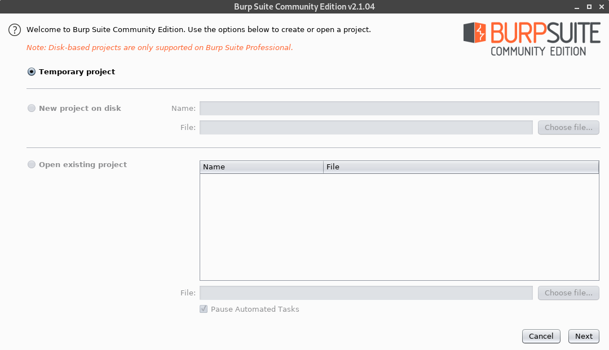

Click next and just use the defaults:

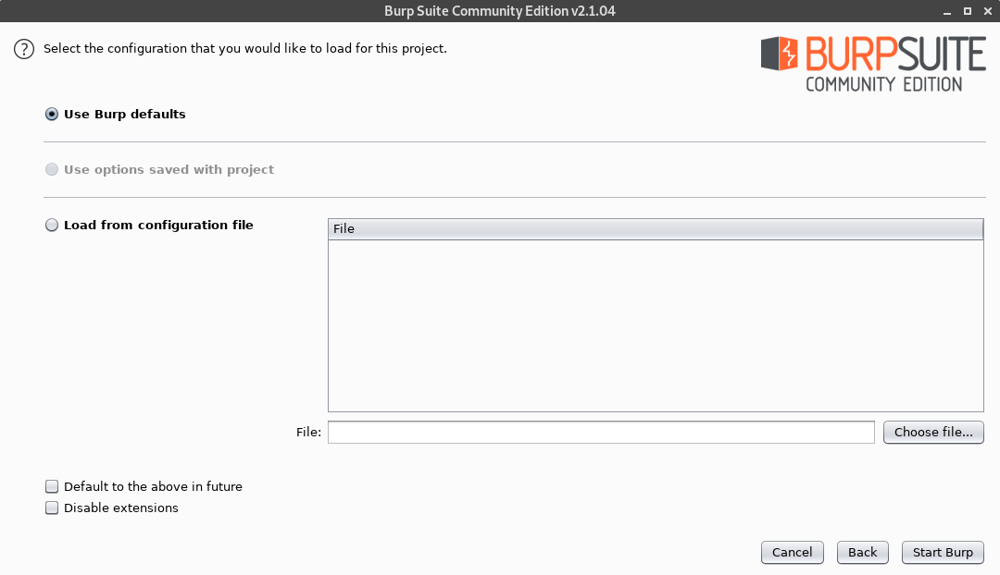

Click **Start Burp**. You will be presented with the following screen:

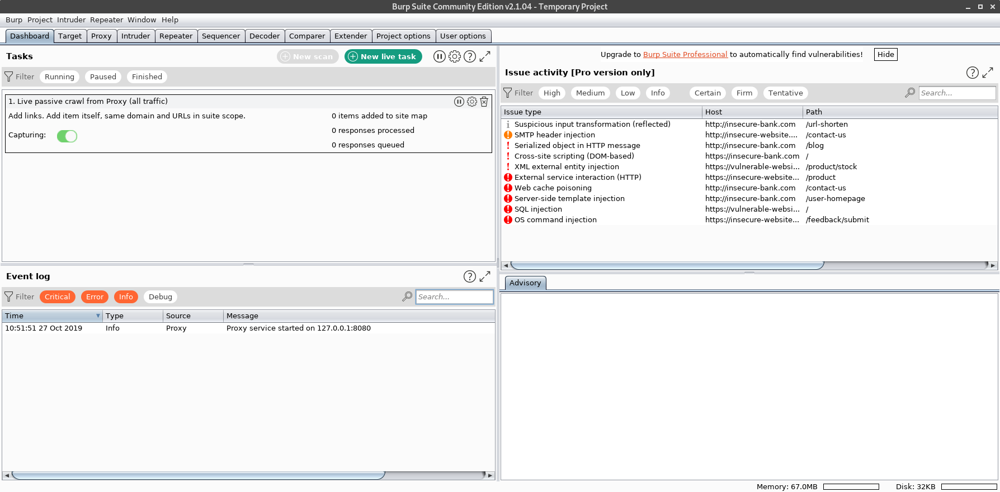

Now navigate to the **Proxy** tab. It will look like:

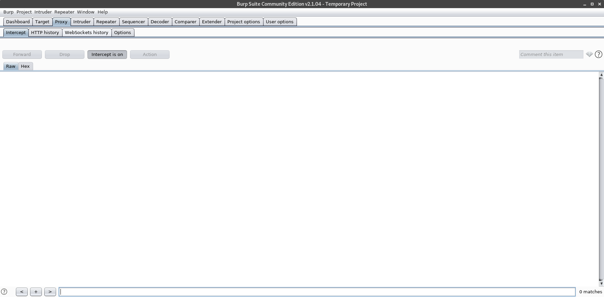

Now click **Intercept is On** button to turn it off. The screen will look like:

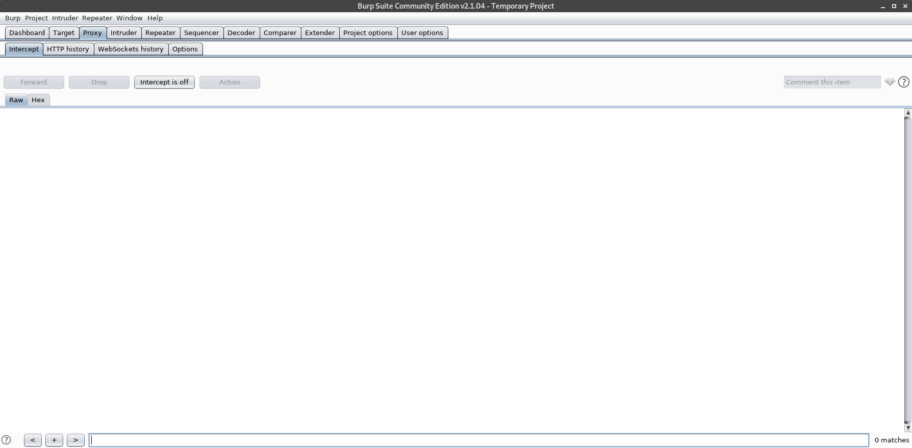

Now go to the **HTTP History** Tab:

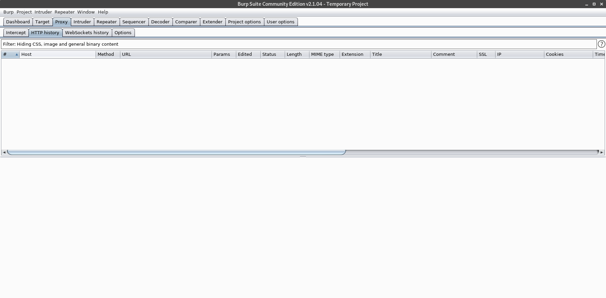


Now that Burp is setup properly, we can setup our emulator to work with it. Start up the emulator and open the emulator settings. It can be found as the three horizontal dots on the side bar:

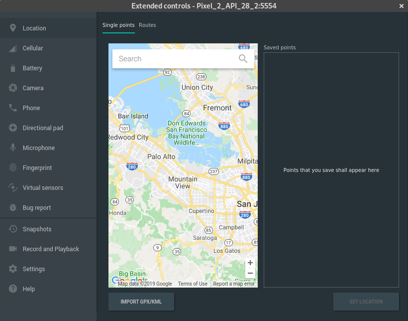

Then navigate to the Settings/Proxy tab:

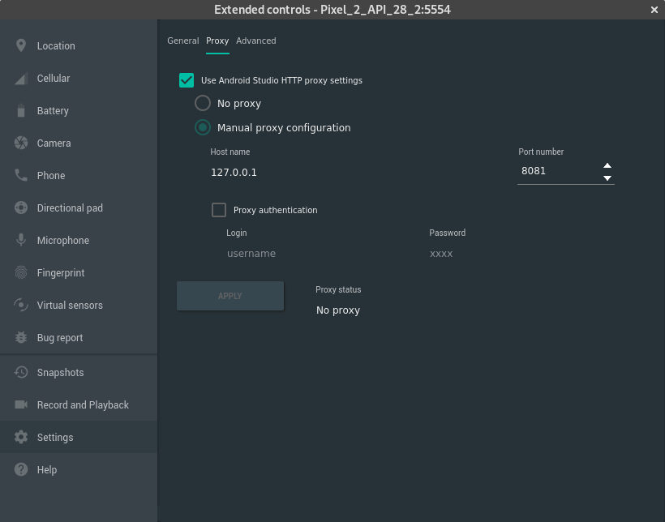

If the Burp settings are the defaults, then change your proxy settings to reflect the following and press apply:

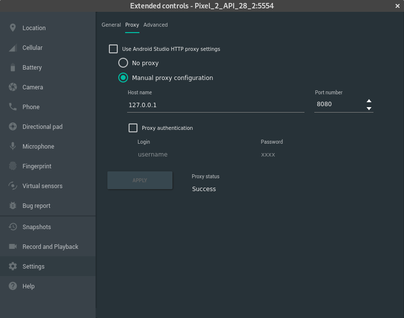

Now if you use the Chrome browser inside the emulator to navigate to a http website, you will see the traffic. But if you try to navigate to a https website, it will fail. This is because the device does not have the root certificate for the MITM proxy and thus does not trust the connection. 

### Retrieving Burp Certificate

We have to get the certificate that Burp provides. This will also be useful in the next section as we can reuse the certificate. I recommend using Firefox to get the certificate. Open Firefox, go to **Preferences** and then **General**. Scroll to the bottom of the General Preferences and click **Network Settings**. You will be presented with the following dialog:

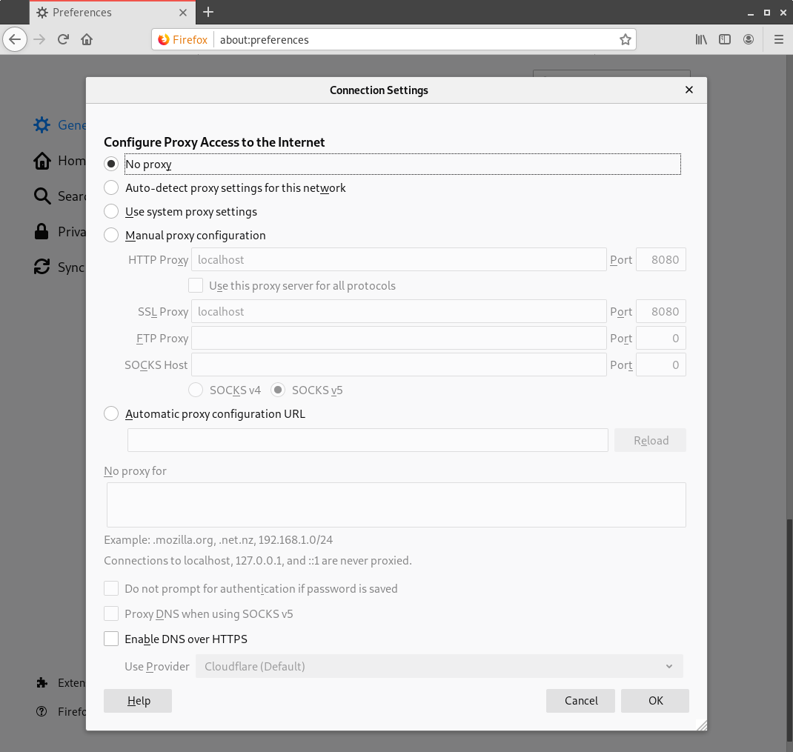

Change the settings to reflect the following:

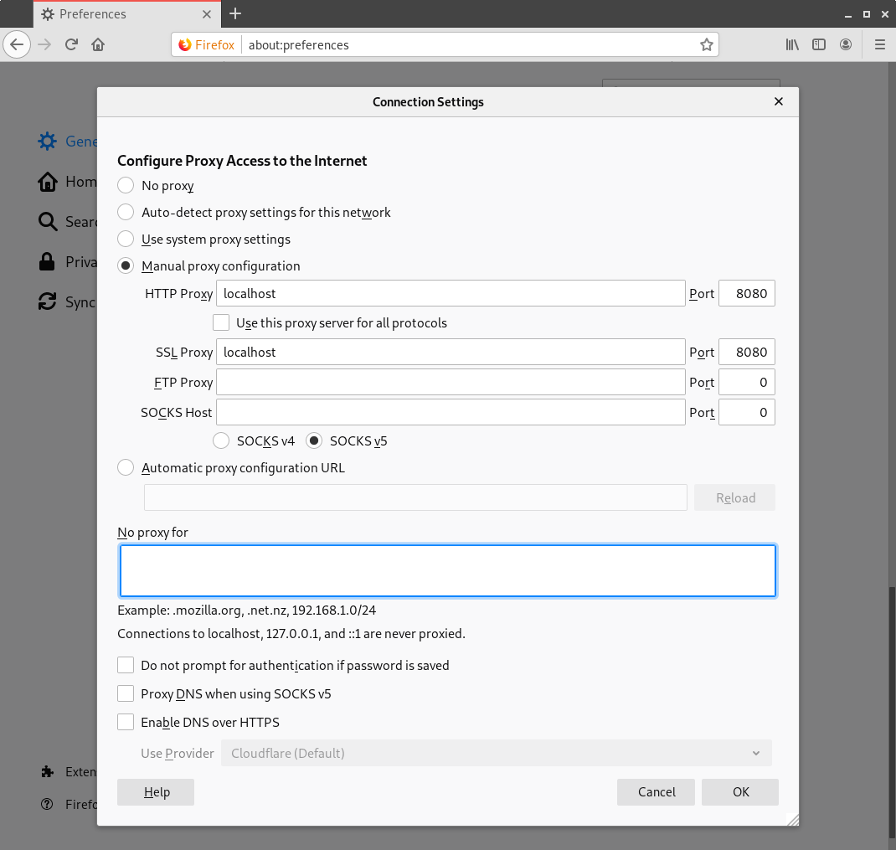

Apply the settings and navigate to http://burp in Firefox. You will be presented with:

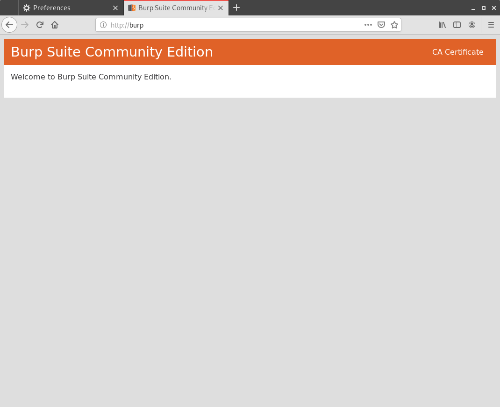

In the top right corner is where you can download the CA Certificate that we will need. 

Now we can upload the file to our device. Using ADB, push the file to the sdcard of the emulator:

```
adb push cacert.der /sdcard/
```

Now go to your emulator. Go to the device settings. This can be done from the notification dropdown or by dragging the action bar up. You will see:

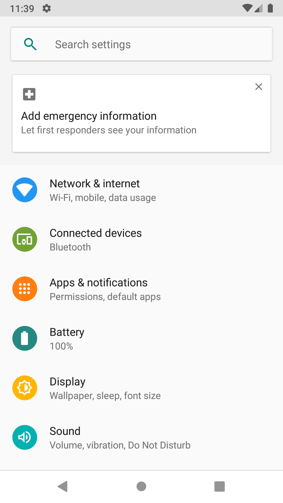

Navigate to **Security & Location**:

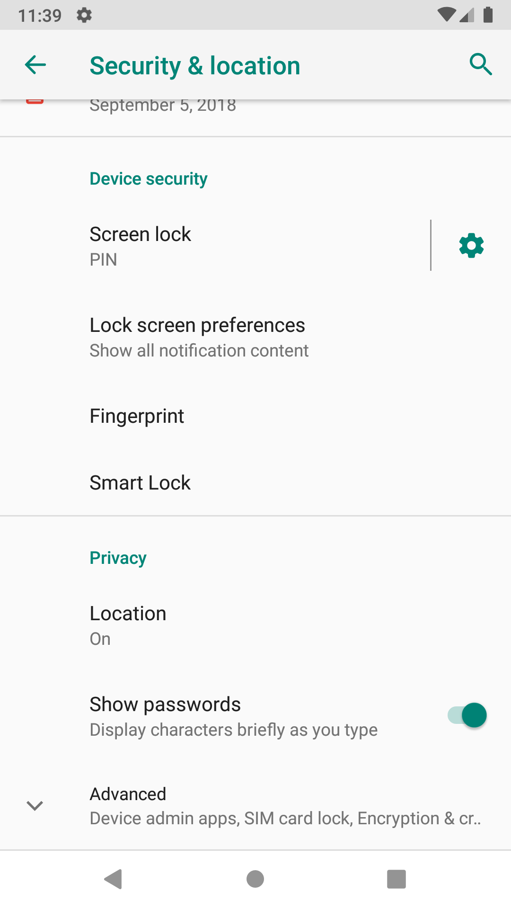

Scroll down to the bottom and expand the options. You will then see:

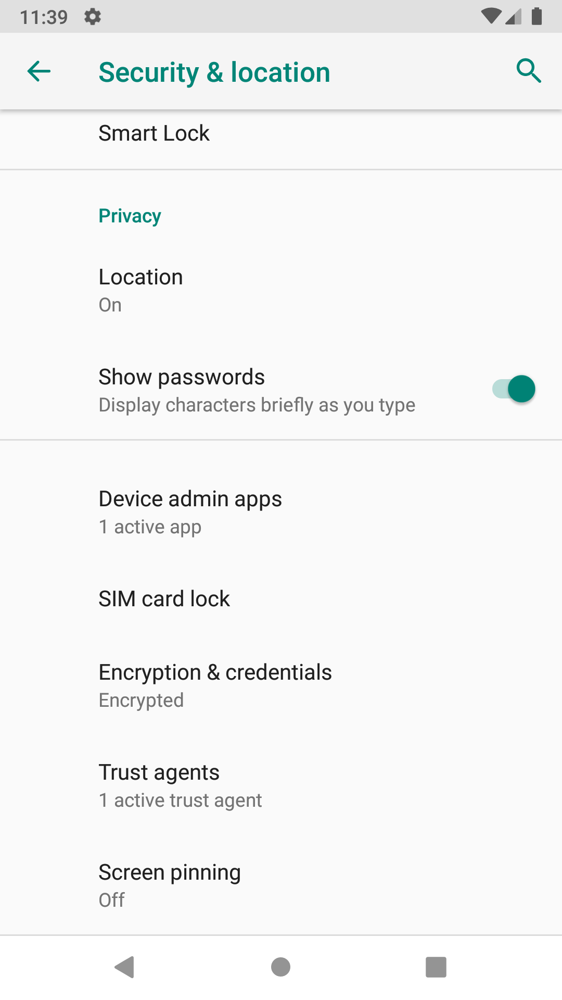

Select **Encryption and Credentials**:

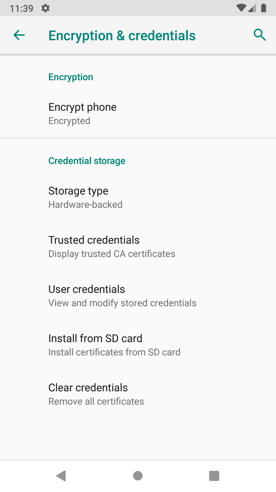

Select **Install from SD Card**. Navigate to the sd card and install the certificate. 

Now navigate to an encrypted site again, such as https://google.com. It should work and you will see the traffic inside of Burp.

### Exporting Burp Private Key
You will need to export the private key that Burp uses for later use with the TCP MITM tool. To do this, navigate to the options tab inside the Proxy. Then click **Export CA Certificate**. Select **Private key in DER format**:

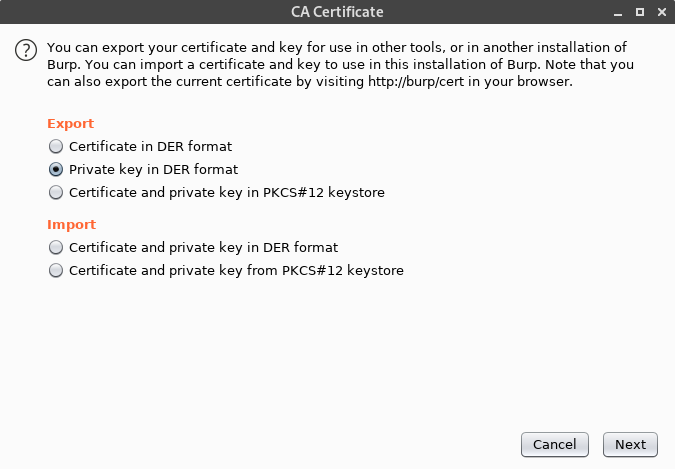

Save this to a location that you remember. The file that was saved is in the DER format. We need it in the PEM format. `openssl` provides a tool to convert between the two formats:

```
openssl rsa -inform der -in burp.private.key -out burp.private.key.pem
```

Now remember where this file is. We will need it for the TCP MITM tool.

### Getting OAUTH Information

Now lets open TerrorTime. If you haven't installed TerrorTime or haven't uploaded the database to the device, see my Task 4 write up. 

When you try to login, it will fail. This is because our HTTP proxy does not know how to deal with XMPP. We will solve this later. Look at your **HTTP history** window in Burp. You will see the host https://register.terrortime.app. We need to inspect this request for any information that we can use. We can see that the Raw request has an authorization header:

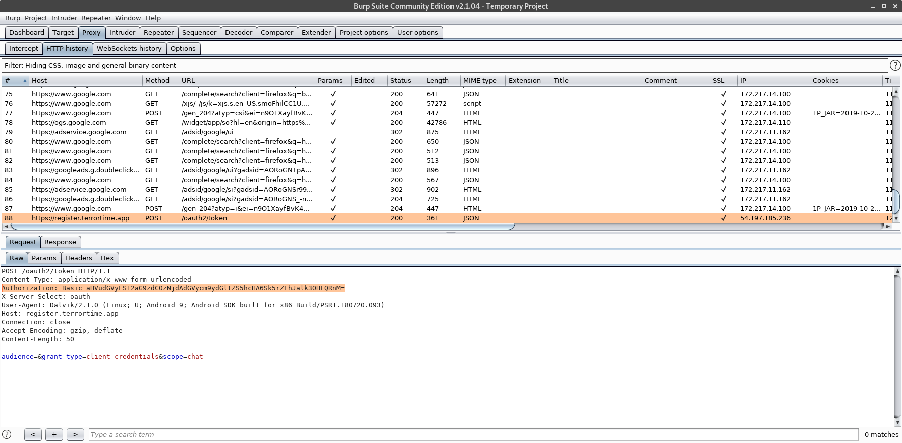

The authorization header shows that it is basic authorization and it is encoded in base64. To decode it, we can use standard linux tools:

```
$ echo aHVudGVyLS12aG9zdC0zNjdAdGVycm9ydGltZS5hcHA6Sk5rZEhJalk3OHFQRnM= | base64 -d
hunter--vhost-367@terrortime.app:JNkdHIjY78qPFs
```

We see that we have our username and some password. We know that this system is using an OAUTH token because the request returned an access_token. 

What password we have is most likely the client secret. The main question is if this token is valid for any user. But first, we have to get the rest of the chat application working with a different MITM tool.

### TCP MITM Tool

First, undo any proxy settings in the Android Emulator. Keep the CA Certificate loaded in the device as we will be using that later. Ensure that the emulator will connect to the internet without Burp. 

To create a TCP MITM attack, I used a python script called `mitm_relay.py` which can be found [here](https://github.com/jrmdev/mitm_relay.git). This script supports STARTTLS which XMPP can use. If you use a tool that doesn't support STARTTLS, you will find quickly that it won't work. 

Once you clone the repo, we can use the tool to intercept traffic. Type the following command to start the MITM relay:

```
sudo python2 ./mitm_relay.py -r 443:54.91.5.130:443 -c ~/Downloads/cacert.pem -k ~/Downloads/burp.private.key.pem
```

We need to run this as root because it will be using our host machines 443 port. 

Now, we need to edit our database to use this proxy. Open your database editor (see Task 3 for a database intro), and change the xsip column to read your computer's IP address. Now stop the application from running, re-upload the database, and then login. You should see traffic reported in your proxy. 

You will get a lot of data that looks like:

```xml

[!] Client cert/key not provided.
[+] Webserver listening on ('127.0.0.1', 49999)
[+] Relay listening on tcp 443 -> 54.91.5.130:443
[+] New client: ('10.12.96.102', 56122) -> 54.91.5.130:443
C >> S [ 10.12.96.102:56122 >> 54.91.5.130:443 ] [ Sun 29 Sep 22:57:12 ] [ 173 ]  
<stream:stream xmlns='jabber:client' to='terrortime.app' xmlns:stream='http://etherx.jabber.org/streams' version='1.0' from='damian--vhost-367@terrortime.app' xml:lang='en'>

S >> C [ 54.91.5.130:443 >> 10.12.96.102:56122 ] [ Sun 29 Sep 22:57:13 ] [ 327 ]  
<?xml version='1.0'?><stream:stream id='11855431906653073409' version='1.0' xml:lang='en' xmlns:stream='http://etherx.jabber.org/streams' to='damian--vhost-367@terrortime.app' from='terrortime.app' xmlns='jabber:client'><stream:features><starttls xmlns='urn:ietf:params:xml:ns:xmpp-tls'><required/></starttls></stream:features>


...
...
...
...

S >> C [ 54.91.5.130:443 >> 10.12.96.102:56122 ] [ Sun 29 Sep 22:57:25 ] [ 2048 ]  
<message to='damian--vhost-367@terrortime.app/chat' from='damian--vhost-367@terrortime.app'><result id='1569474716' queryid='6ff779f5-7cb0-4162-b29a-28424e30eee0' xmlns='urn:xmpp:mam:1'><forwarded xmlns='urn:xmpp:forward:0'><message xml:lang='en' to='emma--vhost-367@terrortime.app/chat' from='damian--vhost-367@terrortime.app/chat' type='chat' id='02305148-e097-4d20-8642-acb11b66a6ca' xmlns='jabber:client'><archived by='damian--vhost-367@terrortime.app' id='1569474716' xmlns='urn:xmpp:mam:tmp'/><stanza-id by='damian--vhost-367@terrortime.app' id='1569474716' xmlns='urn:xmpp:sid:0'/><body>{&quot;messageKey&quot;:{&quot;t74rkRwbHxXNn65TXBtXa9CKcFc/TqwuzLIyzunjQE4=&quot;:&quot;CEToSN0MIshsdzyF3Xw2bZECkA6Tzj6jiDr0Ilx5whVIFcIQLQMtJrEvPN71IkRSybUdwV3OjqJEj8jpEg2d215wLugnwz4/8kRDE4Ey+3p8fZjIU4TqTm8cNcq28xIl8wzLobCtiUYLaVs3qIWuoVzq0ubkwR/KCQfnvkVGx8hxQ92/wZhR6UzE21BoSzusbiY27x+oc2cuSDOeiA/BuqZqV7Jzoido1It4x2UXWGR062VslkzjBHink1H6BMe3l4q7DB8MjNSEw7Q0hEFcSPLBp9R9xvHZ0G6XG+WFYEI/BHhnDHmI1kiDxEzGBIKPgL6GxULRoRQ0MvAsvYElwA==&quot;,&quot;8hzN5Gf7XN5jzA3x3nayJKaYoIUjsp7Qrmnquiv8eL8=&quot;:&quot;CKY4yeA4gkk/dvLVJnGa7m7lN1WslQHO4HYBxTaIA1kJbEe49PtAcCu+8WG52UF1qvIvEiJ02w8ite7rSWTQlRSQgyoKiJw/5pR9FYOvD06+tnVYg8Ejso/0MTSKBYEkLKS9T4xDfEK/mQpVjsvgMOmreqCm+/LYTT71yAqBL8UfduYs8szGu0XvrA0X7FVW+XgbFceYMlhfr5UQSgFgFxeA1h+6I/XWt4Jl7i8jA1lWP03lBlvQFtcUgV5K4xT+lBWaK5C+irSq47gpOGSd9ErpQwpIOQdatk8DUnf/V7WVTZTmmbTjStuwx/A5hTZ/Wi1WR5+Ia0G+TfChGuQtDw==&quot;},&quot;messageSig&quot;:&quot;f52CWycrMOOlxbH614CTlL9FUsud0PwSileZfZfLfQM=&quot;,&quot;message&quot;:{&quot;msg&quot;:&quot;nL64souptfCaXlGDqRzOu7vRa+rCihSwErWUaz5nzLrqfuHDle+VKWugsMDAT8W2TBO1MNdMEydcxQ+xf3QacrLL0lETZl6DTmp4an+RRvaoDHAxWpGd43FZAZn6EfD9lfvHSTHMcpEmJSLaEloRgZ1FbShZr84ikZGFFtVNWG1VnzzjVm9PNfczTFPyIvnE1QpwsNm4MI/DqAgD0LKmDEYW1P3vwKjezq6AkZxUZ7IYwfMkc3S0QpaREiVscQ+GF7a4jJ0ki5418jHdh2qjLg==&quot;,&quot;iv&quot;:&quot;B8Lgg3/9rscOALlziTPZ4Q==&quot;}}</body></message><delay from='terrortime.app' stamp='1970-01-01T00:26:09.474716Z' xmlns='urn:xmpp:delay'/></forwarded></result></message>

...
...
...
...

S >> C [ 54.91.5.130:443 >> 10.12.96.102:56122 ] [ Sun 29 Sep 22:57:26 ] [ 1085 ]  
<iq xml:lang='en' to='damian--vhost-367@terrortime.app/chat' from='damian--vhost-367@terrortime.app' type='result' id='hJCnN-202'><vCard xmlns='vcard-temp'><DESC>-----BEGIN PUBLIC KEY-----
MIIBITANBgkqhkiG9w0BAQEFAAOCAQ4AMIIBCQKCAQAJvK0QZhDPs9ZwU931ZJWU
bZNN0UyWkcOmcijIdKwHVMuvwv7025yVEHpNtthxXVuUlbBC4WV47JhlgcLL297M
V6qlRpQ9rJut0k2ih6zp5ePBq9mNTqjlANZyrJv+8oeOtf8Xo3IFTV7TlDchby57
INGZjILDGS1K+BrN7ihvgqHNpM+PdeTCOZDUzpftXQir4vc9z0VandioFLW3rqgc
R1UD8ToAlpriJSXypJKRE7YUnZCOedLVQKPQRUFJrDBgj/Y6gcZKw1MFFrdnKZZa
80DZAepjsWViw76EdHU9OlDl+wIiZU/iXGEFYPgdDXUiSHk+h6VOt8pHiyAL9R3d
AgMBAAE=
-----END PUBLIC KEY-----
:-----BEGIN PUBLIC KEY-----
MIIBITANBgkqhkiG9w0BAQEFAAOCAQ4AMIIBCQKCAQAI5dHy+4KwGVeriOlvGSwq
U26bOgMexcysCUZhbN8Rg0vQ1dmcQq/Dd0N2vU6+KFe1F7kKatL1HnGF/Nj+KpuR
jatdWgG674rtd79qi4sg1GytHusEPj3cvlGXGIhjwElQ67PotKkAl7zk9qN7WBhe
BqjMKGCYp7FTOSUbElQxGASZTuns3yoESdTF/sT6b3KP6RoxA60/BCW4s06/zNeo
XV821ZZbw6NV79BAU48JePdKoqYU8m5C677t3Jc+akmT52zn6h5YNJHDIW3KrRmB
lyRqDLgbtV7seVBh123QKrinEe/mtjMo3Mtq8TyFlbtqWA0hyo/4ox+D1b62kB5V
AgMBAAE=
-----END PUBLIC KEY-----
</DESC></vCard></iq>

S >> C [ 54.91.5.130:443 >> 10.12.96.102:56122 ] [ Sun 29 Sep 22:57:26 ] [ 26 ]  
<r xmlns='urn:xmpp:sm:3'/>

C >> S [ 10.12.96.102:56122 >> 54.91.5.130:443 ] [ Sun 29 Sep 22:57:26 ] [ 33 ]  
<a xmlns='urn:xmpp:sm:3' h='31'/>

```

There will be a lot of data there. Now, that is just the data for our given user. Now that we can intercept traffic, lets see if we can login as our cell leader. 

My first attempt failed. I replaced the username *hunter* with *ian* inside my database file and attempted to authenticate. This failed. I suspect that the username is used to link the pin and client secret together. But, if you use the application enough, you will notice that the register.terrortime.app address isn't used each time. This means that the OAUTH token must be cached. Lets login as hunter and then retrieve the database from the device:

```
adb pull /data/data/com.badguy.terrortime/databases/clientDB.db .
```

If you inspect the database file, you will see that the atok and rtok fields have been filled in. Let's now change the cid to ian and repush the database file to the emulator. 

You will find that login in as ian with the same pin will let you into the application. 

Continue this process until you determine which is the cell leader. You may have to sign into other accounts and build a graph of connected users to determine who is at the top. Unfortunately I cannot help with this as much as everyone's user will be different. 

### Retrieving the last used message

Once you determine who the organizational leader is, we need to extract the last message sent. To do this, login as the leader and view the output of the MITM proxy. 

The very last `<message>..</message>` will be the last message sent. Ignore the timestamps as those are not set properly. You will need to submit the message body. For example, my last message was:

```xml
<message to='damian--vhost-367@terrortime.app/chat' from='damian--vhost-367@terrortime.app'><result id='1569474716' queryid='6ff779f5-7cb0-4162-b29a-28424e30eee0' xmlns='urn:xmpp:mam:1'><forwarded xmlns='urn:xmpp:forward:0'><message xml:lang='en' to='emma--vhost-367@terrortime.app/chat' from='damian--vhost-367@terrortime.app/chat' type='chat' id='02305148-e097-4d20-8642-acb11b66a6ca' xmlns='jabber:client'><archived by='damian--vhost-367@terrortime.app' id='1569474716' xmlns='urn:xmpp:mam:tmp'/><stanza-id by='damian--vhost-367@terrortime.app' id='1569474716' xmlns='urn:xmpp:sid:0'/><body>{"messageKey":{"t74rkRwbHxXNn65TXBtXa9CKcFc/TqwuzLIyzunjQE4=":"CEToSN0MIshsdzyF3Xw2bZECkA6Tzj6jiDr0Ilx5whVIFcIQLQMtJrEvPN71IkRSybUdwV3OjqJEj8jpEg2d215wLugnwz4/8kRDE4Ey+3p8fZjIU4TqTm8cNcq28xIl8wzLobCtiUYLaVs3qIWuoVzq0ubkwR/KCQfnvkVGx8hxQ92/wZhR6UzE21BoSzusbiY27x+oc2cuSDOeiA/BuqZqV7Jzoido1It4x2UXWGR062VslkzjBHink1H6BMe3l4q7DB8MjNSEw7Q0hEFcSPLBp9R9xvHZ0G6XG+WFYEI/BHhnDHmI1kiDxEzGBIKPgL6GxULRoRQ0MvAsvYElwA==","8hzN5Gf7XN5jzA3x3nayJKaYoIUjsp7Qrmnquiv8eL8=":"CKY4yeA4gkk/dvLVJnGa7m7lN1WslQHO4HYBxTaIA1kJbEe49PtAcCu+8WG52UF1qvIvEiJ02w8ite7rSWTQlRSQgyoKiJw/5pR9FYOvD06+tnVYg8Ejso/0MTSKBYEkLKS9T4xDfEK/mQpVjsvgMOmreqCm+/LYTT71yAqBL8UfduYs8szGu0XvrA0X7FVW+XgbFceYMlhfr5UQSgFgFxeA1h+6I/XWt4Jl7i8jA1lWP03lBlvQFtcUgV5K4xT+lBWaK5C+irSq47gpOGSd9ErpQwpIOQdatk8DUnf/V7WVTZTmmbTjStuwx/A5hTZ/Wi1WR5+Ia0G+TfChGuQtDw=="},"messageSig":"f52CWycrMOOlxbH614CTlL9FUsud0PwSileZfZfLfQM=","message":{"msg":"nL64souptfCaXlGDqRzOu7vRa+rCihSwErWUaz5nzLrqfuHDle+VKWugsMDAT8W2TBO1MNdMEydcxQ+xf3QacrLL0lETZl6DTmp4an+RRvaoDHAxWpGd43FZAZn6EfD9lfvHSTHMcpEmJSLaEloRgZ1FbShZr84ikZGFFtVNWG1VnzzjVm9PNfczTFPyIvnE1QpwsNm4MI/DqAgD0LKmDEYW1P3vwKjezq6AkZxUZ7IYwfMkc3S0QpaREiVscQ+GF7a4jJ0ki5418jHdh2qjLg==","iv":"B8Lgg3/9rscOALlziTPZ4Q=="}}</body></message><delay from='terrortime.app' stamp='1970-01-01T00:26:09.474716Z' xmlns='urn:xmpp:delay'/></forwarded></result></message>
```

Converting the xml to json in an online xml to json convert got me:

```json
{
   "@to": "damian--vhost-367@terrortime.app/chat",
   "@from": "damian--vhost-367@terrortime.app",
   "result": {
      "@id": "1569474716",
      "@queryid": "6ff779f5-7cb0-4162-b29a-28424e30eee0",
      "forwarded": {
         "message": {
            "@lang": "en",
            "@to": "emma--vhost-367@terrortime.app/chat",
            "@from": "damian--vhost-367@terrortime.app/chat",
            "@id": "02305148-e097-4d20-8642-acb11b66a6ca",
            "archived": {
               "@by": "damian--vhost-367@terrortime.app",
               "@id": "1569474716"
            },
            "stanza-id": {
               "@by": "damian--vhost-367@terrortime.app",
               "@id": "1569474716"
            },
            "body": {
               "messageKey": {
                  "t74rkRwbHxXNn65TXBtXa9CKcFc/TqwuzLIyzunjQE4=": "CEToSN0MIshsdzyF3Xw2bZECkA6Tzj6jiDr0Ilx5whVIFcIQLQMtJrEvPN71IkRSybUdwV3OjqJEj8jpEg2d215wLugnwz4/8kRDE4Ey+3p8fZjIU4TqTm8cNcq28xIl8wzLobCtiUYLaVs3qIWuoVzq0ubkwR/KCQfnvkVGx8hxQ92/wZhR6UzE21BoSzusbiY27x+oc2cuSDOeiA/BuqZqV7Jzoido1It4x2UXWGR062VslkzjBHink1H6BMe3l4q7DB8MjNSEw7Q0hEFcSPLBp9R9xvHZ0G6XG+WFYEI/BHhnDHmI1kiDxEzGBIKPgL6GxULRoRQ0MvAsvYElwA==",
                  "8hzN5Gf7XN5jzA3x3nayJKaYoIUjsp7Qrmnquiv8eL8=": "CKY4yeA4gkk/dvLVJnGa7m7lN1WslQHO4HYBxTaIA1kJbEe49PtAcCu+8WG52UF1qvIvEiJ02w8ite7rSWTQlRSQgyoKiJw/5pR9FYOvD06+tnVYg8Ejso/0MTSKBYEkLKS9T4xDfEK/mQpVjsvgMOmreqCm+/LYTT71yAqBL8UfduYs8szGu0XvrA0X7FVW+XgbFceYMlhfr5UQSgFgFxeA1h+6I/XWt4Jl7i8jA1lWP03lBlvQFtcUgV5K4xT+lBWaK5C+irSq47gpOGSd9ErpQwpIOQdatk8DUnf/V7WVTZTmmbTjStuwx/A5hTZ/Wi1WR5+Ia0G+TfChGuQtDw=="
               },
               "messageSig": "f52CWycrMOOlxbH614CTlL9FUsud0PwSileZfZfLfQM=",
               "message": {
                  "msg": "nL64souptfCaXlGDqRzOu7vRa+rCihSwErWUaz5nzLrqfuHDle+VKWugsMDAT8W2TBO1MNdMEydcxQ+xf3QacrLL0lETZl6DTmp4an+RRvaoDHAxWpGd43FZAZn6EfD9lfvHSTHMcpEmJSLaEloRgZ1FbShZr84ikZGFFtVNWG1VnzzjVm9PNfczTFPyIvnE1QpwsNm4MI/DqAgD0LKmDEYW1P3vwKjezq6AkZxUZ7IYwfMkc3S0QpaREiVscQ+GF7a4jJ0ki5418jHdh2qjLg==",
                  "iv": "B8Lgg3/9rscOALlziTPZ4Q=="
               }
            }
         },
         "delay": {
            "@from": "terrortime.app",
            "@stamp": "1970-01-01T00:26:09.474716Z"
         }
      }
   }
}
```

Copy the `body` tag and submit it.

## Submission

### Organization leader
- damian--vhost-367@terrortime.app

### Message Body
```json
{
   "messageKey": {
      "t74rkRwbHxXNn65TXBtXa9CKcFc/TqwuzLIyzunjQE4=": "CEToSN0MIshsdzyF3Xw2bZECkA6Tzj6jiDr0Ilx5whVIFcIQLQMtJrEvPN71IkRSybUdwV3OjqJEj8jpEg2d215wLugnwz4/8kRDE4Ey+3p8fZjIU4TqTm8cNcq28xIl8wzLobCtiUYLaVs3qIWuoVzq0ubkwR/KCQfnvkVGx8hxQ92/wZhR6UzE21BoSzusbiY27x+oc2cuSDOeiA/BuqZqV7Jzoido1It4x2UXWGR062VslkzjBHink1H6BMe3l4q7DB8MjNSEw7Q0hEFcSPLBp9R9xvHZ0G6XG+WFYEI/BHhnDHmI1kiDxEzGBIKPgL6GxULRoRQ0MvAsvYElwA==",
      "8hzN5Gf7XN5jzA3x3nayJKaYoIUjsp7Qrmnquiv8eL8=": "CKY4yeA4gkk/dvLVJnGa7m7lN1WslQHO4HYBxTaIA1kJbEe49PtAcCu+8WG52UF1qvIvEiJ02w8ite7rSWTQlRSQgyoKiJw/5pR9FYOvD06+tnVYg8Ejso/0MTSKBYEkLKS9T4xDfEK/mQpVjsvgMOmreqCm+/LYTT71yAqBL8UfduYs8szGu0XvrA0X7FVW+XgbFceYMlhfr5UQSgFgFxeA1h+6I/XWt4Jl7i8jA1lWP03lBlvQFtcUgV5K4xT+lBWaK5C+irSq47gpOGSd9ErpQwpIOQdatk8DUnf/V7WVTZTmmbTjStuwx/A5hTZ/Wi1WR5+Ia0G+TfChGuQtDw=="
   },
   "messageSig": "f52CWycrMOOlxbH614CTlL9FUsud0PwSileZfZfLfQM=",
   "message": {
      "msg": "nL64souptfCaXlGDqRzOu7vRa+rCihSwErWUaz5nzLrqfuHDle+VKWugsMDAT8W2TBO1MNdMEydcxQ+xf3QacrLL0lETZl6DTmp4an+RRvaoDHAxWpGd43FZAZn6EfD9lfvHSTHMcpEmJSLaEloRgZ1FbShZr84ikZGFFtVNWG1VnzzjVm9PNfczTFPyIvnE1QpwsNm4MI/DqAgD0LKmDEYW1P3vwKjezq6AkZxUZ7IYwfMkc3S0QpaREiVscQ+GF7a4jJ0ki5418jHdh2qjLg==",
      "iv": "B8Lgg3/9rscOALlziTPZ4Q=="
   }
}
```

## Extra Information Found
### Client secret:
- JNkdHIjY78qPFs


